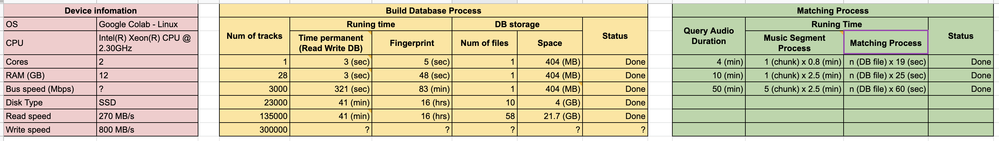

Music ID
==========

Audio fingerprinting and recognition algorithm implemented in Python. 

## Installation and Dependencies:

Read [INSTALLATION.md](INSTALLATION.md)

## Setup

Language: *Python3*

First, install the above dependencies. 

## Quickstart

```bash
$ git clone https://gitlab.com/magiklab/anttizen/deephub/music-id.git
$ cd music-id
$ python music_id/cli/build_fingerprint.py #add fingerprint to database 
$ python music_id/cli/matcher.py -f /path/to/long_audio.mp3  #start predict long audio 
```

## Fingerprinting

Using the fingerprint algorithm from [Audfprint](https://github.com/dpwe/audfprint).

## Configuration options

An example configuration is as follows:

```python
>>> config = {
...     "audfprint": {
...         "db_dir": "./db",
...         "db_base_name": "fpdbase_nozip.pklz",
...         "db_name_shell_pattern": "fpdbase*.pklz",
...         "ncores": 2,
...         "hashbits": 20,
...         "density": 70,
...         "bucketsize": 100,
...         "fanout": 5,
...         "max-matches": 50,
...         "time-quantile": 0.05,
...         "min-count": 10,
...         "exact-count": true,
...         "find-time-range": true
...     }
... }
```

NOTE:
```python
# "db_base_name": The BD file name for adding new tracks.
# "db_name_shell_pattern": The shell pattern of DB file name for searching and matching a query audio on DB files.
# "db_dir": The directory path that contain DB files. Can be a relative path (start at this repository folder) or absolute path. Default is './db'
# "ncores": Run multiprocess on the number of device cores.
```


### Recognizing: On Disk

Through the terminal:

```bash
$ python music_id/cli/matcher.py -f './mp3/youtube_sources/broma Fin del mundo.mp3'
Output at: /tmp/music-id-5d537cae-e43a-474f-8225-82d4ffcfe71f
...
...
...
The result stored at /tmp/music-id-5d537cae-e43a-474f-8225-82d4ffcfe71f/07072020_113231/results/broma Fin del mundo.annotation.json
All processes completed in 135(s)
The process ended.
```

Open the annotation.json file, you can see the result:

```json
{
    "total_time": 135.62506294250488,
    "config": {
        "db_name": "fpdbase_nozip.pklz",
        "ncores": 2,
        "hashbits": 20,
        "density": 70,
        "bucketsize": 100,
        "fanout": 5,
        "max-matches": 50,
        "time-quantile": 0.05,
        "min-count": 10,
        "exact-count": true,
        "find-time-range": true
    },
    "result": {
        "clip_title": "broma Fin del mundo",
        "assets": [
            {
                "title": "AM09_72_An Unfinished Life.mp3",
                "query_segments": [[0:00:43, 0:01:00], [0:01:36, 0:03:33]],
                "asset_segments": [[0:00:02, 0:00:19], [0:00:00, 0:01:57]]
            }
        ]
    }
}
```


## How does it work?

Reference to https://labrosa.ee.columbia.edu/matlab/audfprint/

## Performance
